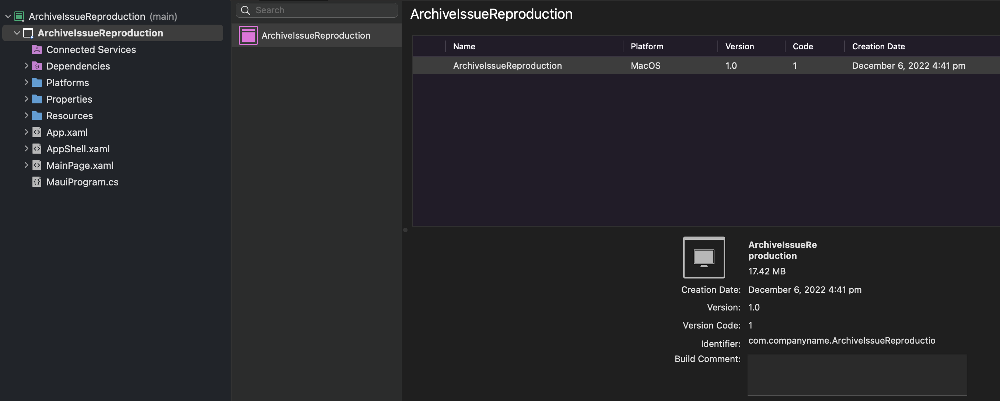

# Maui Archive Reproduction
Sample code reproduction of an issue affecting archival of maui apps


## Problem

When using Visual Studio For Mac 2022 to archive Maui apps on iOS, if the MauiApp references a .net standard class library, the following error occurs during the archival:

```bash
Assets file '/Users/axemasta/Documents/GitHub/MauiArchiveReproduction/src/MyClassLib/obj/project.assets.json' doesn't have a target for 'net6.0-maccatalyst'. Ensure that restore has run and that you have included 'net6.0-maccatalyst' in the TargetFrameworks for your project.
```

I can confirm that the project builds & runs in debug & release configurations.

## Reproduction

This issue can be reproduced on my local machine with the source code in this repo.

I tried an archive before adding the referenced project and it succeeded:



And then when I added the `MyClassLib` project and referenced it in the Maui app (in `MainPage.xaml`), the archival failed (build for release first) with the following error:


Here is the complete output from the archive window:

```bash

Building ArchiveIssueReproduction (Release)
Build started 06/12/2022 16:53:54.
__________________________________________________
Project "/Users/axemasta/Documents/GitHub/MauiArchiveReproduction/src/MyClassLib/MyClassLib.csproj" (Build target(s)):

Target _BeforeCoreCompileImageAssets:
    Directory "obj/Release/net6.0-maccatalyst/actool" doesn't exist. Skipping.
Target _BeforeCoreCompileInterfaceDefinitions:
  Skipping target "_BeforeCoreCompileInterfaceDefinitions" because it has no inputs.
Target _BeforeCoreCompileInterfaceDefinitions:
  Skipping target "_BeforeCoreCompileInterfaceDefinitions" because it has no inputs.
Target _BeforeCoreCompileInterfaceDefinitions:
  Skipping target "_BeforeCoreCompileInterfaceDefinitions" because it has no inputs.
Target _CoreCompileInterfaceDefinitions:
  Skipping target "_CoreCompileInterfaceDefinitions" because it has no inputs.
Target _BeforeCoreCompileSceneKitAssets:
  Skipping target "_BeforeCoreCompileSceneKitAssets" because it has no inputs.
Target _BeforeCoreCompileSceneKitAssets:
  Skipping target "_BeforeCoreCompileSceneKitAssets" because it has no inputs.
Target _BeforeCoreCompileSceneKitAssets:
  Skipping target "_BeforeCoreCompileSceneKitAssets" because it has no inputs.
Target _CoreCompileSceneKitAssets:
  Skipping target "_CoreCompileSceneKitAssets" because it has no inputs.
Target _BeforeCompileTextureAtlases:
  Skipping target "_BeforeCompileTextureAtlases" because it has no inputs.
Target _BeforeCompileTextureAtlases:
  Skipping target "_BeforeCompileTextureAtlases" because it has no inputs.
Target _BeforeCompileTextureAtlases:
  Skipping target "_BeforeCompileTextureAtlases" because it has no inputs.
Target _CoreCompileTextureAtlases:
  Skipping target "_CoreCompileTextureAtlases" because it has no inputs.
Target _BeforeCompileCoreMLModels:
    Directory "obj/Release/net6.0-maccatalyst/coremlc" doesn't exist. Skipping.
Target PrepareForBuild:
    Creating directory "bin/Release/net6.0-maccatalyst/".
    Creating directory "/Users/axemasta/Documents/GitHub/MauiArchiveReproduction/src/MyClassLib/obj/Release/net6.0-maccatalyst/refint/".
    Creating directory "obj/Release/net6.0-maccatalyst/ref".
Target ResolvePackageAssets:
    /usr/local/share/dotnet/sdk/7.0.100/Sdks/Microsoft.NET.Sdk/targets/Microsoft.PackageDependencyResolution.targets(267,5): error NETSDK1005: Assets file '/Users/axemasta/Documents/GitHub/MauiArchiveReproduction/src/MyClassLib/obj/project.assets.json' doesn't have a target for 'net6.0-maccatalyst'. Ensure that restore has run and that you have included 'net6.0-maccatalyst' in the TargetFrameworks for your project.
Done building target "ResolvePackageAssets" in project "MyClassLib.csproj" -- FAILED.

Done building project "MyClassLib.csproj" -- FAILED.

Build FAILED.

/usr/local/share/dotnet/sdk/7.0.100/Sdks/Microsoft.NET.Sdk/targets/Microsoft.PackageDependencyResolution.targets(267,5): error NETSDK1005: Assets file '/Users/axemasta/Documents/GitHub/MauiArchiveReproduction/src/MyClassLib/obj/project.assets.json' doesn't have a target for 'net6.0-maccatalyst'. Ensure that restore has run and that you have included 'net6.0-maccatalyst' in the TargetFrameworks for your project.
    0 Warning(s)
    1 Error(s)

Time Elapsed 00:00:00.19

Assets file '/Users/axemasta/Documents/GitHub/MauiArchiveReproduction/src/MyClassLib/obj/project.assets.json' doesn't have a target for 'net6.0-maccatalyst'. Ensure that restore has run and that you have included 'net6.0-maccatalyst' in the TargetFrameworks for your project.
```
